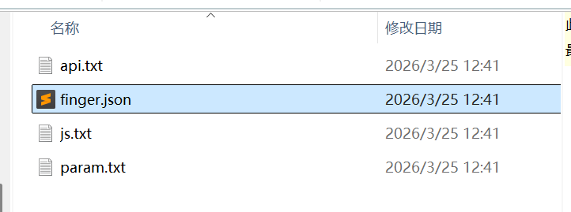
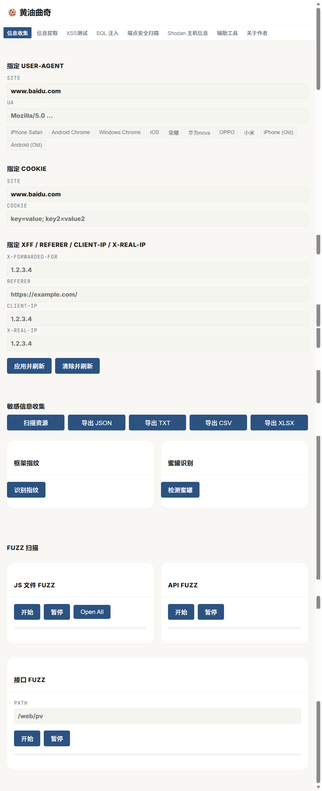
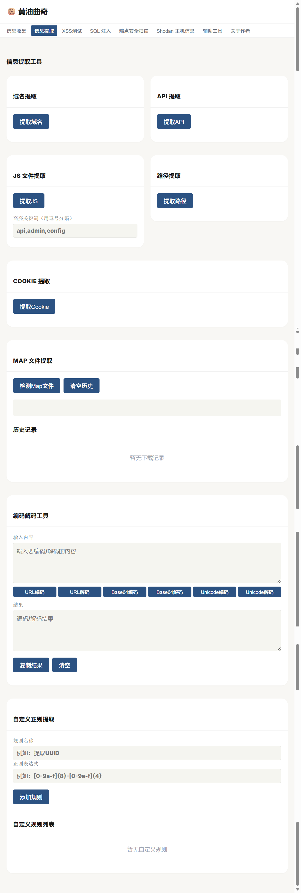
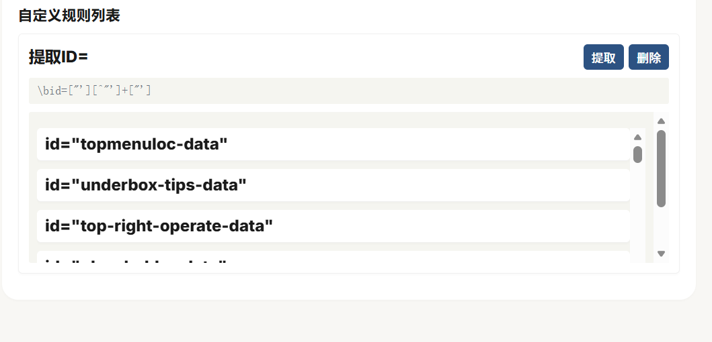
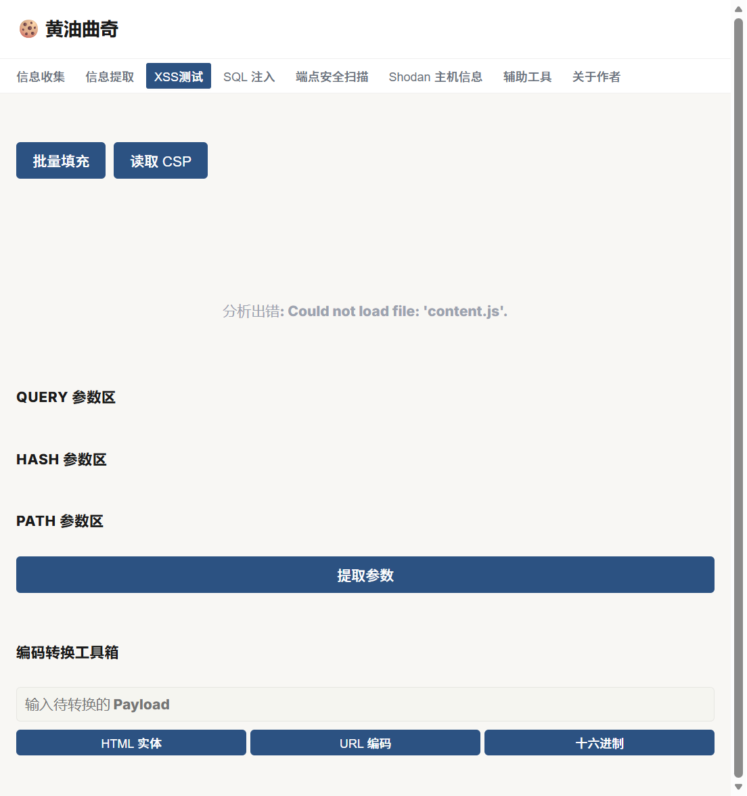
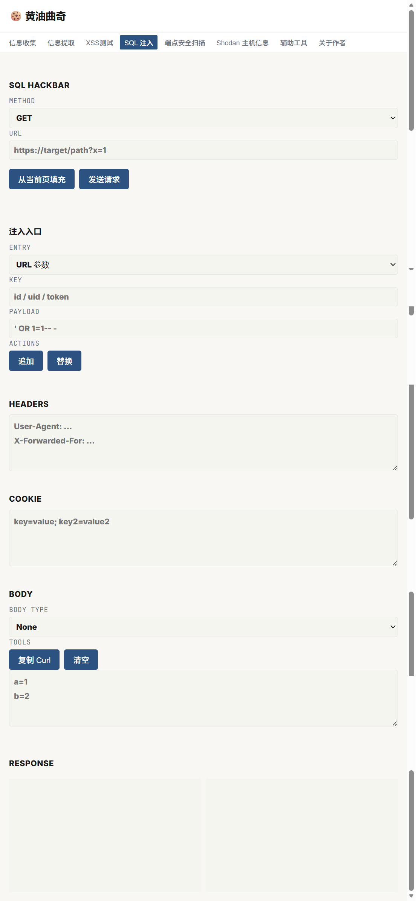
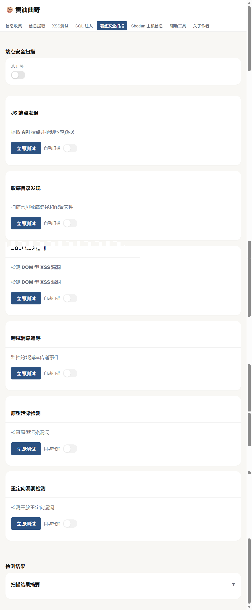
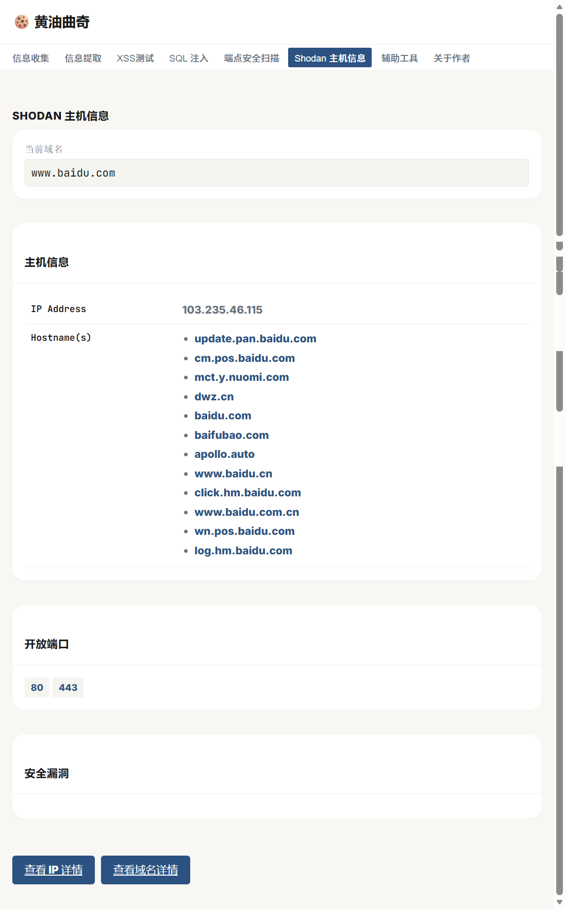

<div align="center">
<h1>🍪 黄油曲奇 v1.1.0</h1>
<h3>集成化渗透测试浏览器插件</h3>

<p>
  <a href="#-快速开始"></a>
  
  
  
  
  
</p>
<p><em>黄油曲奇是一款集成化渗透测试浏览器插件，专为安全测试人员和开发者设计。它提供了丰富的安全测试工具，包括信息收集、信息提取、XSS 测试、SQL 注入测试、端点安全扫描、Shodan 主机信息查询以及多种辅助工具，帮助用户快速识别和评估 Web 应用的安全漏洞。</em></p>

<p><em>该插件集成了 7 大核心功能模块，覆盖了 Web 应用渗透测试的各个方面。通过直观的用户界面和强大的功能，黄油曲奇使安全测试变得简单高效，即使是非专业安全人员也能轻松操作。</em></p>


<p><em>如果师傅觉得工具有用的话，不妨给个 Star🌟</em></p>

</div>

---

<!-- TOC -->

- [功能特性](#功能特性)
- [系统要求](#系统要求)
- [工具使用](#工具使用)
- [快速开始](#-快速开始)
- [项目结构](#项目结构)
- [功能模块详解](#功能模块详解)
- [技术特点](#技术特点)
- [使用指南](#使用指南)
- [注意事项](#注意事项)
- [作者信息](#作者信息)
- [免责声明](#免责声明)
- [致敬开源](#致敬开源)

<!-- /TOC -->

## 功能特性

| 特性 | 说明 |
|------|------|
| 🔍 **信息收集** | User-Agent管理 · Cookie管理 · HTTP头部管理 · 敏感信息收集 · 框架指纹识别 · 蜜罐检测 · Fuzz扫描 |
| 📋 **信息提取** | 域名提取 · API提取 · JS文件提取 · 路径提取 · Cookie提取 · Map文件提取 · 编码解码工具 · 自定义正则提取 |
| 🛡️ **XSS测试** | 批量填充 · CSP读取 · 参数提取 · 编码转换工具箱 |
| 💉 **SQL注入测试** | SQL HackBar · 多种请求方法 · 多种注入入口 · 响应分析 · Curl命令生成 |
| 🔐 **端点安全扫描** | JS端点发现 · 敏感目录发现 · DOM XSS检测 · 跨域消息追踪 · 原型污染检测 · 重定向漏洞检测 |
| 🌐 **Shodan主机信息** | 域名信息 · 开放端口 · 安全漏洞 · 详细信息链接 |
| 🛠️ **辅助工具** | Vue快速检测 · JavaScript工具 · 批量URL打开工具 · URL列表管理 |

---

## 系统要求

- **浏览器**：Chrome 88+ 或 Edge 88+
- **操作系统**：Windows、macOS、Linux
- **权限要求**：需要以下浏览器权限
  - activeTab
  - scripting
  - webRequest
  - cookies
  - contentSettings
  - declarativeNetRequest
  - storage
  - tabs
  - contextMenus
  - downloads
  - <all_urls>（主机权限）

---

## 工具使用

### 信息收集

​	信息收集功能中的Fuzz扫描部分的扫描字典，师傅们可以自行收集和使用自己的常用字典或者添加内容，在插件的data/  目录下自行修改即可。





### 信息提取



自定义正则提取例如：

id = “ ”

```
\bid=["'][^"']+["']
```



### XSS测试



### SQL注入



### 端点安全扫描



### Shodan



### 辅助工具

Vue快速检测

JAVASCRIPT

批量URL打开工具


---

## 🚀 快速开始

### 安装方法

1. 克隆或下载项目到本地
2. 打开Chrome浏览器，进入扩展管理页面（chrome://extensions/）
3. 开启开发者模式
4. 点击"加载已解压的扩展程序"
5. 选择项目目录
6. 扩展将自动安装并在浏览器工具栏显示

### 首次使用

1. 在目标网站上点击扩展图标
2. 选择需要使用的功能模块
3. 根据界面提示进行操作
4. 查看结果并导出报告（如果需要）

---

## 项目结构

```
FrontRecon/
├── assets/                # 资源文件
│   └── FrontRecon_tool.png  # 插件图标
├── data/                  # 数据文件
│   ├── api.txt            # API路径列表
│   ├── finger.json        # 框架指纹数据
│   ├── js.txt             # JS文件路径列表
│   └── param.txt          # 参数列表
├── src/                   # 源代码
│   ├── content_scripts/   # 内容脚本
│   │   ├── dom-xss-detector.js       # DOM XSS检测
│   │   ├── endpoint-finder.js         # JS端点发现
│   │   ├── postmessage-tracker.js     # 跨域消息追踪
│   │   ├── prototype-pollution.js     # 原型污染检测
│   │   ├── redirect-detector.js       # 重定向漏洞检测
│   │   ├── results-panel.js           # 结果面板
│   │   └── sensitive-dir-finder.js    # 敏感目录发现
│   ├── modules/           # 功能模块
│   │   ├── info-extractor.js          # 信息提取核心模块
│   │   ├── encode-decode.js           # 编码解码工具模块
│   │   ├── map-extractor.js           # Map文件提取模块
│   │   └── custom-regex.js            # 自定义正则模块
│   ├── background.js      # 后台脚本
│   ├── content.js         # 内容脚本
│   ├── popup.html         # 弹出界面
│   ├── popup.js           # 弹出界面脚本
│   └── style.css          # 样式文件
├── manifest.json          # 扩展配置文件
└── README.md              # 项目说明文档
```

---

## 功能模块详解

### 1. 信息收集

<details>
<summary><b>模块功能</b></summary>

| 功能 | 说明 |
|------|------|
| **User-Agent管理** | 支持自定义User-Agent，提供多种预设UA选项（iPhone、Android、Windows等） |
| **Cookie管理** | 支持自定义Cookie，方便测试不同身份下的应用行为 |
| **HTTP头部管理** | 支持设置X-Forwarded-For、Referer、Client-IP、X-Real-IP等头部 |
| **敏感信息收集** | 扫描页面资源，支持导出为JSON、TXT、CSV、XLSX格式 |
| **框架指纹识别** | 识别网站使用的前端框架，帮助了解目标技术栈 |
| **蜜罐检测** | 检测目标网站是否为蜜罐，避免陷入安全陷阱 |
| **Fuzz扫描** | 支持JS文件、API、接口参数的Fuzz扫描，发现潜在漏洞 |

</details>

### 2. 信息提取

<details>
<summary><b>模块功能</b></summary>

| 功能 | 说明 |
|------|------|
| **域名提取** | 从页面源码中提取所有域名信息，支持一键复制和JSON导出 |
| **API提取** | 提取页面中的API接口URL，自动过滤静态资源文件 |
| **JS文件提取** | 提取页面引用的JavaScript文件路径，支持高亮关键词标记 |
| **路径提取** | 提取页面中的所有路径信息，支持一键复制和JSON导出 |
| **Cookie提取** | 获取当前域名的所有Cookie，以name=value形式展示 |
| **Map文件提取** | 检测并下载Source Map文件(.js.map)，保存下载历史 |
| **编码解码工具** | 支持URL、Base64、Unicode编码解码，方便数据处理 |
| **自定义正则提取** | 支持添加自定义正则规则，动态提取页面信息 |

</details>

### 3. XSS测试

<details>
<summary><b>模块功能</b></summary>

| 功能 | 说明 |
|------|------|
| **批量填充** | 自动填充表单和参数，方便快速测试 |
| **CSP读取** | 读取并分析内容安全策略，了解防护措施 |
| **参数提取** | 提取URL中的Query、Hash、Path参数，方便测试 |
| **编码转换工具箱** | 支持HTML实体、URL编码、十六进制编码转换，方便构造payload |

</details>

### 4. SQL注入测试

<details>
<summary><b>模块功能</b></summary>

| 功能 | 说明 |
|------|------|
| **SQL HackBar** | 模拟SQL注入攻击，测试数据库漏洞 |
| **多种请求方法** | 支持GET、POST、PUT、PATCH、DELETE等多种请求方法 |
| **多种注入入口** | 支持URL参数、POST表单、JSON、Cookie、Header等多种注入入口 |
| **响应分析** | 显示响应头和响应体，方便分析注入结果 |
| **Curl命令生成** | 生成可复制的Curl命令，方便在终端中执行 |

</details>

### 5. 端点安全扫描

<details>
<summary><b>模块功能</b></summary>

| 功能 | 说明 |
|------|------|
| **JS端点发现** | 提取API端点并检测敏感数据，发现潜在的API安全问题 |
| **敏感目录发现** | 扫描常见敏感路径和配置文件，发现信息泄露 |
| **DOM XSS检测** | 检测DOM型XSS漏洞，发现前端安全问题 |
| **跨域消息追踪** | 监控跨域消息传递事件，发现潜在的安全问题 |
| **原型污染检测** | 检查原型污染漏洞，发现JavaScript安全问题 |
| **重定向漏洞检测** | 检测开放重定向漏洞，发现可能的跳转攻击 |

</details>

### 6. Shodan主机信息

<details>
<summary><b>模块功能</b></summary>

| 功能 | 说明 |
|------|------|
| **域名信息** | 显示当前域名的主机信息，包括IP地址、地理位置等 |
| **开放端口** | 显示目标主机的开放端口，了解网络暴露面 |
| **安全漏洞** | 显示目标主机的已知安全漏洞，了解潜在风险 |
| **详细信息链接** | 提供Shodan详细信息的链接，方便进一步分析 |

</details>

### 7. 辅助工具

<details>
<summary><b>模块功能</b></summary>

| 功能 | 说明 |
|------|------|
| **Vue快速检测** | 检测Vue应用，导出路由，绕过路由守卫，发现前端路由问题 |
| **JavaScript工具** | 禁用/启用JavaScript，反调试绕过脚本，方便测试不同场景 |
| **批量URL打开工具** | 批量打开URL列表，支持延迟设置，方便测试多个页面 |
| **URL列表管理** | 保存、加载、编辑URL列表，方便管理测试目标 |

</details>

---

## 技术特点

1. **模块化设计**：采用模块化架构，各个功能模块独立运行，便于维护和扩展
2. **实时扫描**：支持实时检测和扫描，及时发现安全问题
3. **多格式导出**：支持多种格式的报告导出，方便分析和分享
4. **用户友好界面**：直观的用户界面，操作简单，适合不同技术水平的用户
5. **丰富的预设**：提供多种预设选项，方便快速测试
6. **自动化扫描**：支持自动扫描模式，减少手动操作，提高效率
7. **跨平台支持**：支持Chrome和Edge浏览器，覆盖主流浏览器环境
8. **深度集成**：与浏览器深度集成，提供无缝的测试体验

---

## 使用指南

### 基本操作流程

1. **安装扩展**：按照快速开始中的步骤安装插件
2. **打开扩展**：在目标网站上点击扩展图标
3. **选择功能**：从标签页中选择需要使用的功能模块
4. **配置参数**：根据需要配置相关参数
5. **执行操作**：点击相应按钮执行操作
6. **查看结果**：查看操作结果和检测报告
7. **导出数据**：根据需要导出数据或报告

### 功能模块使用详解

#### 信息收集模块

1. **User-Agent设置**：
   - 在"指定 User-Agent"部分输入自定义UA或选择预设UA
   - 点击"应用并刷新"按钮生效

2. **Cookie设置**：
   - 在"指定 Cookie"部分输入自定义Cookie
   - 点击"应用并刷新"按钮生效

3. **HTTP头部设置**：
   - 在相应输入框中设置X-Forwarded-For、Referer等头部
   - 点击"应用并刷新"按钮生效

4. **敏感信息收集**：
   - 点击"扫描资源"按钮
   - 等待扫描完成后，查看结果
   - 点击相应按钮导出为JSON、TXT、CSV或XLSX格式

5. **框架指纹识别**：
   - 点击"识别指纹"按钮
   - 查看识别结果

6. **蜜罐检测**：
   - 点击"检测蜜罐"按钮
   - 查看检测结果

7. **Fuzz扫描**：
   - 选择需要扫描的类型（JS文件、API或接口参数）
   - 点击"开始"按钮
   - 查看扫描结果

#### 信息提取模块

1. **域名提取**：
   - 点击"提取域名"按钮
   - 查看提取的域名列表
   - 点击"复制"复制所有域名
   - 点击"导出JSON"导出为JSON文件

2. **API提取**：
   - 点击"提取API"按钮
   - 查看提取的API接口URL（自动过滤静态资源）
   - 支持一键复制和JSON导出

3. **JS文件提取**：
   - 点击"提取JS"按钮
   - 查看提取的JavaScript文件路径
   - 在"高亮关键词"输入框中输入关键词（逗号分隔）
   - 包含关键词的项会被高亮显示

4. **路径提取**：
   - 点击"提取路径"按钮
   - 查看提取的路径信息
   - 支持一键复制和JSON导出

5. **Cookie提取**：
   - 点击"提取Cookie"按钮
   - 查看当前域名的所有Cookie
   - 点击"复制全部"复制所有Cookie

6. **Map文件提取**：
   - 点击"检测Map文件"按钮
   - 查看可下载的Source Map文件列表
   - 点击"下载"按钮下载Map文件
   - 在"历史记录"中查看已下载的文件

7. **编码解码工具**：
   - 在输入框中输入待处理的内容
   - 点击相应按钮进行URL/Base64/Unicode编码或解码
   - 点击"复制结果"复制输出内容

8. **自定义正则提取**：
   - 输入规则名称和正则表达式
   - 点击"添加规则"保存规则
   - 在规则列表中点击"提取"按钮执行提取
   - 点击"删除"按钮移除规则

#### XSS测试模块

1. **批量填充**：
   - 点击"批量填充"按钮
   - 自动填充表单和参数

2. **CSP读取**：
   - 点击"读取 CSP"按钮
   - 查看CSP策略

3. **参数提取**：
   - 点击"提取参数"按钮
   - 查看提取的Query、Hash、Path参数

4. **编码转换**：
   - 在输入框中输入待转换的Payload
   - 点击相应按钮进行HTML实体、URL编码或十六进制编码转换

#### SQL注入测试模块

1. **配置请求**：
   - 选择请求方法（GET、POST等）
   - 输入目标URL
   - 选择注入入口（URL参数、POST表单等）
   - 输入注入参数和Payload

2. **发送请求**：
   - 点击"发送请求"按钮
   - 查看响应结果

3. **生成Curl命令**：
   - 点击"复制 Curl"按钮
   - 在终端中执行生成的命令

#### 端点安全扫描模块

1. **启用扫描**：
   - 开启总开关
   - 选择需要启用的扫描模块
   - 可以选择自动扫描模式

2. **执行扫描**：
   - 点击相应模块的"立即测试"按钮
   - 查看扫描结果

3. **查看结果**：
   - 在"检测结果"部分查看扫描结果摘要

#### Shodan主机信息模块

1. **查看信息**：
   - 打开扩展后自动显示当前域名的主机信息
   - 查看开放端口和安全漏洞

2. **查看详细信息**：
   - 点击"查看 IP 详情"或"查看域名详情"按钮
   - 在Shodan网站上查看详细信息

#### 辅助工具模块

1. **Vue检测**：
   - 点击"检测 Vue"按钮
   - 查看检测结果
   - 可以导出路由、绕过路由守卫等

2. **JavaScript工具**：
   - 点击"禁用 JS"或"启用 JS"按钮
   - 使用反调试绕过脚本

3. **批量URL打开**：
   - 在文本框中输入URL列表（每行一个）
   - 设置打开延迟
   - 点击"打开 URL"按钮

4. **URL列表管理**：
   - 保存、加载、编辑URL列表
   - 方便管理测试目标

---

## 注意事项

1. **合法使用**：本工具仅用于合法的安全测试和授权的渗透测试，请勿用于非法用途
2. **性能影响**：某些扫描功能可能会影响浏览器性能，建议在测试环境使用
3. **网络流量**：Fuzz扫描和其他网络操作可能会产生大量网络流量，请合理使用
4. **权限要求**：扩展需要较多权限才能正常工作，这是为了实现完整的安全测试功能
5. **隐私保护**：使用过程中请注意保护个人隐私和敏感信息
6. **法律合规**：使用本工具时，请遵守相关法律法规

---

## 更新日志(更新很晚是因为在玩洛克王国)

### v1.1.0 (2026-04-25)
#### ✨ 新增功能
- **Vue 快速检测增强**:
  - 检测后自动在检测结果区域显示完整 URL 列表
  - 每个 URL 支持单独复制操作（点击复制按钮）
  - 每个 URL 支持单独打开操作（后台打开新标签页）
  - 支持 Vue 2/3 版本检测和 Router 实例分析
  - 支持 Router Mode 自动识别（history/hash）
  - 路由守卫清除和 meta.auth 字段修改

#### 🔧 功能优化
- **信息提取模块优化**:
  - 域名提取：排除文件名、路径片段、连续数字等误报
  - API 提取：排除 37 种静态资源、CDN、静态目录
  - JS 文件提取：排除 .map、webpack 运行时、hot-update 文件
  - 路径提取：排除静态资源、过短路径、连续数字

#### 🐛 Bug 修复
- 修复 executeScript 调用时的参数类型错误
- 修复多个文件功能的已知Bug
- 修复 popup.js 模板字符串转义问题


### v1.0.4 (2026-04-02)
- ✨ 新增信息提取模块
- ✨ 新增域名提取功能
- ✨ 新增API提取功能
- ✨ 新增JS文件提取功能
- ✨ 新增路径提取功能
- ✨ 新增Cookie提取功能
- ✨ 新增Map文件提取功能
- ✨ 新增编码解码工具（URL/Base64/Unicode）
- ✨ 新增自定义正则提取功能
- 🔧 添加downloads权限支持Map文件下载

### v1.0.3 (2026-03-25)
- 🎉 初始版本发布

## 作者信息

- **作者**：0x八月
- **公众号**：0x八月
- **版本**：1.1.0
- **更新日期**：2026-04-25

---

## 免责声明

本工具仅供学习和授权测试使用，作者不对使用本工具造成的任何损害负责。使用本工具即表示您同意遵守相关法律法规，不得用于非法用途。

---

## 致敬开源

  本项目在开发之初最初只是便于自己的日常工作，在一次偶然间发现了这个 [XMCVE-WebRecon](https://github.com/duckpigdog/XMCVE-WebRecon) 项目发现功能很好，但是UI界面有点好看，于是开始进行二次开发，首先优化一下UI界面，然后把自己平时渗透常用的插件集成了一下，在此向原作者 **雾島风起時** 表示诚挚的感谢！后续会增加更多功能和内容

项目参考了如下优秀的开源项目进行二次开发(主要工作就是借鉴项目功能，优化和改进功能，最后结合实战的实际情况的一些想法和点子开发到项目当中)：

[XMCVE-WebRecon](https://github.com/duckpigdog/XMCVE-WebRecon)

Shodan

[VulnRadar](https://github.com/Zacarx/VulnRadar)

URL_Option

还有一些记不清楚的工具插件了，真心感谢。
## Star History

<a href="https://www.star-history.com/?repos=EdinLyle%2FButter_Cookie&type=date&legend=top-left">
 <picture>
   <source media="(prefers-color-scheme: dark)" srcset="https://api.star-history.com/image?repos=EdinLyle/Butter_Cookie&type=date&theme=dark&legend=top-left" />
   <source media="(prefers-color-scheme: light)" srcset="https://api.star-history.com/image?repos=EdinLyle/Butter_Cookie&type=date&legend=top-left" />
   
 </picture>
</a>
