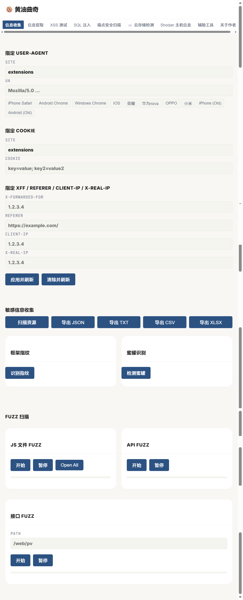
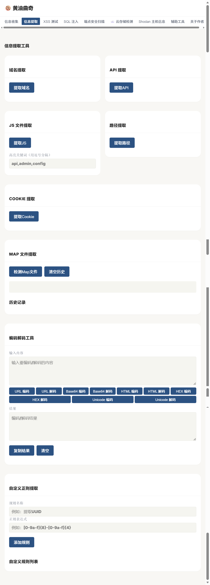
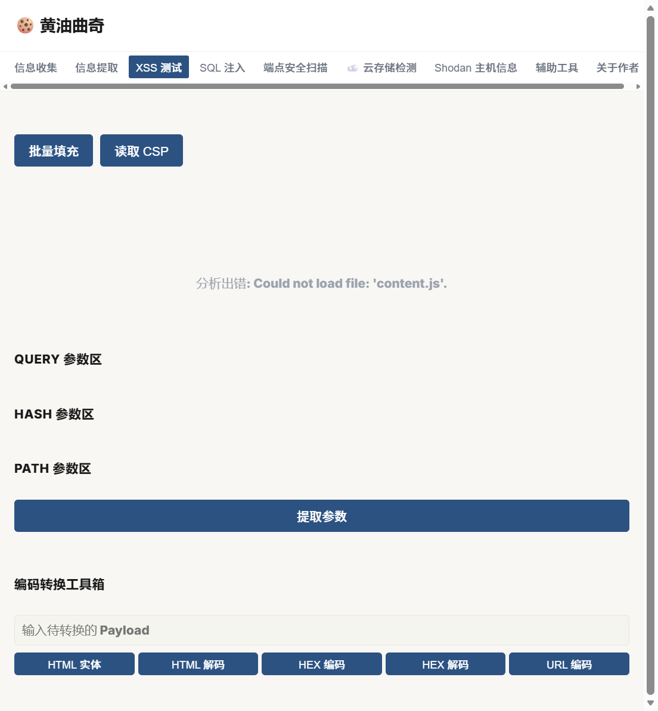
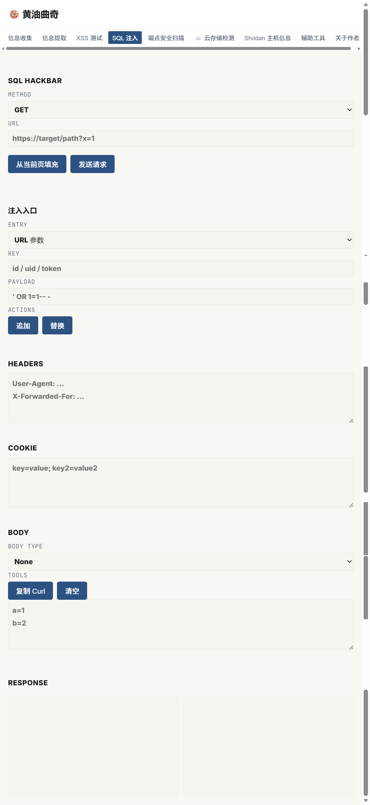
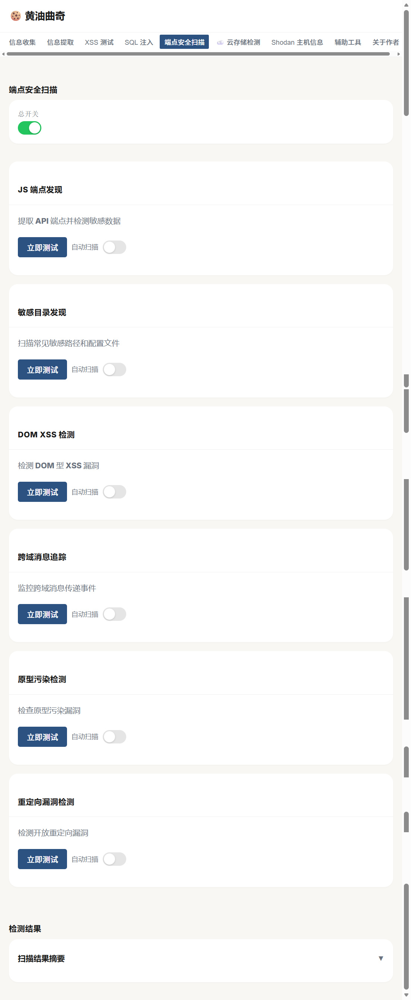
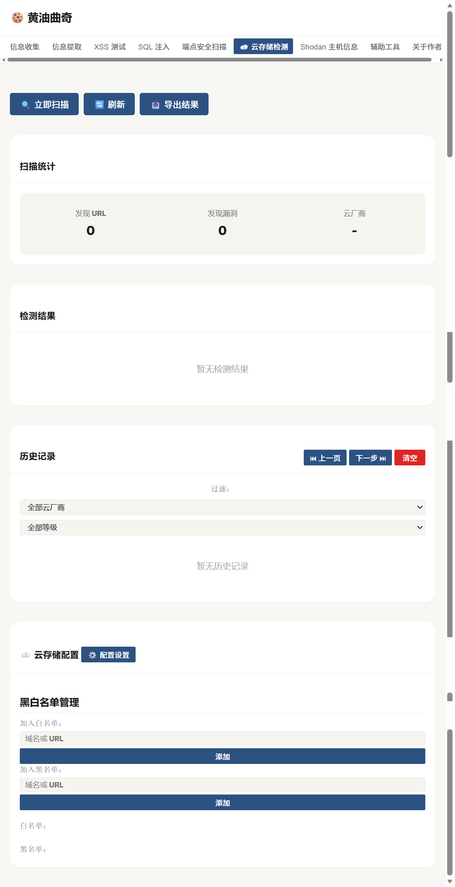
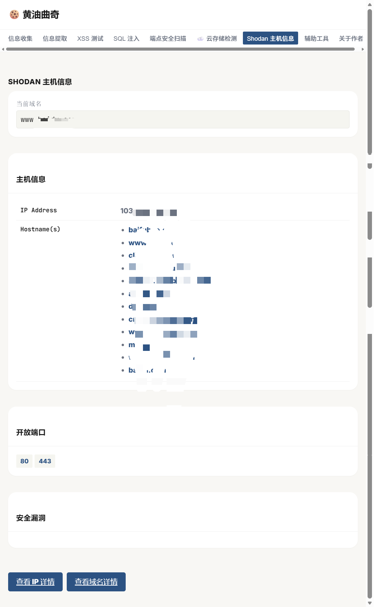
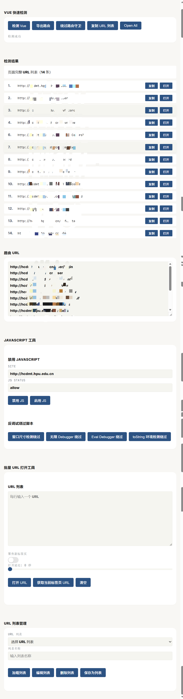

<div align="center">
<h1>🍪 黄油曲奇 v1.2.0</h1>
<h3>集成化渗透测试浏览器插件</h3>

<p>
  <a href="#-快速开始"></a>
  
  
  
  
  
</p>
<p><em>黄油曲奇是一款集成化渗透测试浏览器插件，专为安全测试人员和开发者设计。它提供了丰富的安全测试工具，包括信息收集、信息提取、XSS 测试、SQL 注入测试、端点安全扫描、云存储检测、Shodan 主机信息查询以及多种辅助工具，帮助用户快速识别和评估 Web 应用的安全漏洞。</em></p>
<p><em>该插件集成了 8 大核心功能模块，覆盖了 Web 应用渗透测试的各个方面。通过直观的用户界面和强大的功能，黄油曲奇使安全测试变得简单高效，即使是非专业安全人员也能轻松操作。</em></p>


<p><em>如果师傅觉得工具有用的话，不妨给个 Star🌟</em></p>

</div>

---

<!-- TOC -->

- [功能特性](#功能特性)
- [系统要求](#系统要求)
- [工具使用](#工具使用)
- [快速开始](#-快速开始)
- [项目结构](#项目结构)
- [功能模块详解](#功能模块详解)
- [技术特点](#技术特点)
- [使用指南](#使用指南)
- [注意事项](#注意事项)
- [更新日志](#更新日志)
- [作者信息](#作者信息)
- [免责声明](#免责声明)
- [致敬开源](#致敬开源)

<!-- /TOC -->


## 功能特性

| 特性 | 说明 |
|------|------|
| 🔍 **信息收集** | User-Agent 管理 · Cookie 管理 · HTTP 头部管理 · 敏感信息收集 · 框架指纹识别 · 蜜罐检测 · Fuzz 扫描 |
| 📋 **信息提取** | 域名提取 · API 提取 · JS 文件提取 · 路径提取 · Cookie提取 · Map文件提取 · 编码解码工具（URL/Base64/HTML/HEX/Unicode） · 自定义正则提取 |
| 🛡️ **XSS 测试** | 批量填充 · CSP 读取 · 参数提取 · 编码转换工具箱（HTML/URL/HEX） |
| 💉 **SQL 注入测试** | SQL HackBar · 多种请求方法 · 多种注入入口 · 响应分析 · Curl 命令生成 |
| ☁️ **云存储检测** | 10 家云厂商检测 · 存储桶风险检测 · 安全模式配置 · 主动/被动扫描 · 黑白名单管理 · 高级性能设置 |
| 🔐 **端点安全扫描** | JS 端点发现 · 敏感目录发现 · DOM XSS 检测 · 跨域消息追踪 · 原型污染检测 · 重定向漏洞检测 |
| 🌐 **Shodan 主机信息** | 域名信息 · 开放端口 · 安全漏洞 · 详细信息链接 |
| 🛠️ **辅助工具** | Vue 未授权快速检测 · JavaScript 工具 · 批量 URL 打开工具 · URL 列表管理 |

---

## 系统要求

- **浏览器**：Chrome 88+ 或 Edge 88+
- **操作系统**：Windows、macOS、Linux
- **权限要求**：需要以下浏览器权限
  - activeTab
  - scripting
  - webRequest
  - cookies
  - contentSettings
  - declarativeNetRequest
  - storage
  - tabs
  - contextMenus
  - downloads
  - <all_urls>（主机权限）

---

## 工具使用

### 信息收集

 信息收集功能中的 Fuzz 扫描部分的扫描字典，师傅们可以自行收集和使用自己的常用字典或者添加内容，在插件的 data/  目录下自行修改即可。




### 信息提取



自定义正则提取例如：

id = ""

```
\bid=["'][^"']+["']
```


### XSS 测试



### SQL 注入



### 端点安全扫描



### 云存储检测



### Shodan



### 辅助工具

Vue 未授权快速检测

JAVASCRIPT

批量 URL 打开工具



---

## 🚀 快速开始

### 安装方法

1. 克隆或下载项目到本地
2. 打开 Chrome 浏览器，进入扩展管理页面（chrome://extensions/）
3. 开启开发者模式
4. 点击"加载已解压的扩展程序"
5. 选择项目目录
6. 扩展将自动安装并在浏览器工具栏显示

### 首次使用

1. 在目标网站上点击扩展图标
2. 选择需要使用的功能模块
3. 根据界面提示进行操作
4. 查看结果并导出报告（如果需要）

---


## 更新日志

### v1.2.0 (2026-04-25)

#### ✨ 新增功能

**☁️ 云存储检测模块**

- 新增云存储检测功能标签页
- 支持 10 家云厂商检测：阿里云、腾讯云、华为云、AWS、七牛云、青云、又拍云、京东云、金山云、天翼云
- 支持 6 种风险检测：存储桶可遍历、PUT 上传、DELETE 删除、ACL 可读/写、Policy 可读/写
- 支持主动扫描和被动检测模式
- 新增扫描统计面板（发现 URL、发现漏洞、云厂商分布）
- 新增历史记录管理（分页、过滤、删除）
- 新增检测结果导出功能（JSON 格式）

**⚙️ 云存储配置设置**
- 检测策略设置：安全模式、ACL 检测、Policy 检测、目录回溯探测、页面内容扫描
- 高级性能设置：扫描深度、外链 JS 数量、内联 JS 数量、文件最大大小、URL 上限
- 新增黑白名单管理功能（支持添加/删除域名或 URL）
- 配置自动保存到 chrome.storage.local

**🔧 编码解码工具增强**
- 信息提取模块新增 HTML 编码/解码功能
- 信息提取模块新增 HEX 编码/解码功能

#### 🔧 功能优化

**界面修复**
- 修复云存储检测标签页无法切换的问题
- 修复设置面板切换逻辑错误
- 修复黑白名单管理界面重复显示问题
- 优化黑白名单列表显示样式（带删除按钮）

---

### v1.1.0 (2026-04-25)

#### ✨ 功能优化
- **Vue 快速检测增强**:
  - 检测后自动在检测结果区域显示完整 URL 列表
  - 每个 URL 支持单独复制操作（点击复制按钮）
  - 每个 URL 支持单独打开操作（后台打开新标签页）
  - 完整迁移 VueCrack 所有功能
  - 支持 Vue 2/3 版本检测和 Router 实例分析
  - 支持 Router Mode 自动识别（history/hash）
  - 路由守卫清除和 meta.auth 字段修改

#### 🔧 功能优化
- **信息提取模块优化**:
  - 域名提取：排除文件名、路径片段、连续数字等误报
  - API 提取：排除 37 种静态资源、CDN、静态目录
  - JS 文件提取：排除 .map、webpack 运行时、hot-update 文件
  - 路径提取：排除静态资源、过短路径、连续数字

---

### v1.0.4 (2026-04-02)
- ✨ 新增信息提取模块
- ✨ 新增域名提取功能
- ✨ 新增 API 提取功能
- ✨ 新增 JS 文件提取功能
- ✨ 新增路径提取功能
- ✨ 新增 Cookie 提取功能
- ✨ 新增 Map 文件提取功能
- ✨ 新增编码解码工具（URL/Base64/Unicode）
- ✨ 新增自定义正则提取功能
- 🔧 添加 downloads 权限支持 Map 文件下载

### v1.0.3 (2026-03-25)
- 🎉 初始版本发布


## 作者信息

- **作者**：0x 八月
- **公众号**：0x 八月
- **版本**：1.2.0
- **更新日期**：2026-04-25

---

## 免责声明

本工具仅供学习和授权测试使用，作者不对使用本工具造成的任何损害负责。使用本工具即表示您同意遵守相关法律法规，不得用于非法用途。

---

## 致敬开源

本项目在开发之初最初只是便于自己的日常工作，在一次偶然间发现了这个 [XMCVE-WebRecon](https://github.com/duckpigdog/XMCVE-WebRecon) 项目发现功能很好，但是 UI 界面有点好看，于是开始进行二次开发，首先优化一下 UI 界面，然后把自己平时渗透常用的插件集成了一下，在此向原作者 **雾島风起時** 表示诚挚的感谢！后续会增加更多功能和内容

项目参考了如下优秀的开源项目进行二次开发 (主要工作就是借鉴项目功能，优化和改进功能，最后结合实战的实际情况的一些想法和点子开发到项目当中)：

- [XMCVE-WebRecon](https://github.com/duckpigdog/XMCVE-WebRecon)
- Shodan
- [VulnRadar](https://github.com/Zacarx/VulnRadar)
- URL_Option
- VueCrack
- 谛听鉴-By狐狸

还有一些记不清楚的工具插件了，真心感谢。

## Star History

<a href="https://www.star-history.com/?repos=EdinLyle%2FButter_Cookie&type=date&legend=top-left">
 <picture>
   <source media="(prefers-color-scheme: dark)" srcset="https://api.star-history.com/image?repos=EdinLyle/Butter_Cookie&type=date&theme=dark&legend=top-left" />
   <source media="(prefers-color-scheme: light)" srcset="https://api.star-history.com/image?repos=EdinLyle/Butter_Cookie&type=date&legend=top-left" />
   
 </picture>
</a>
